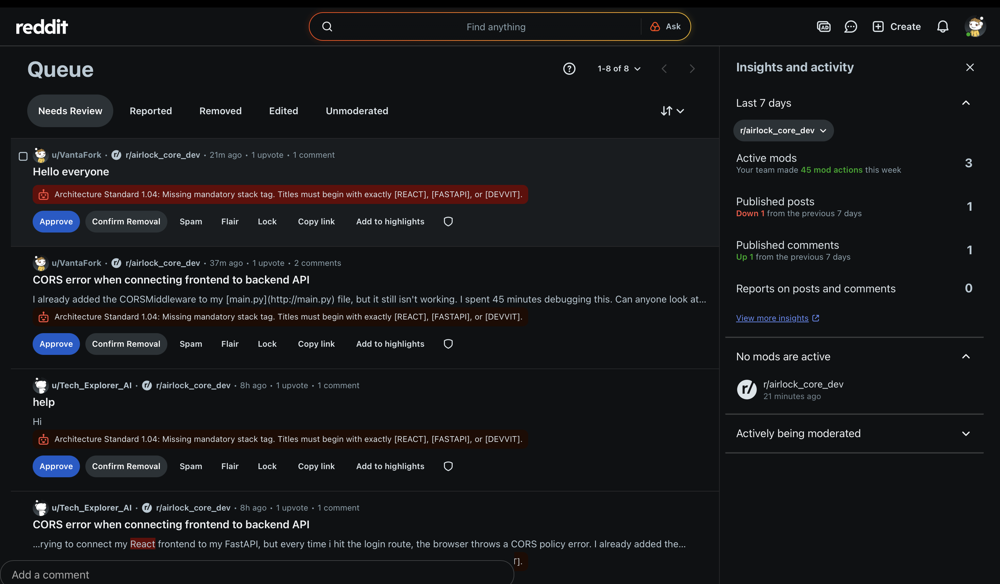
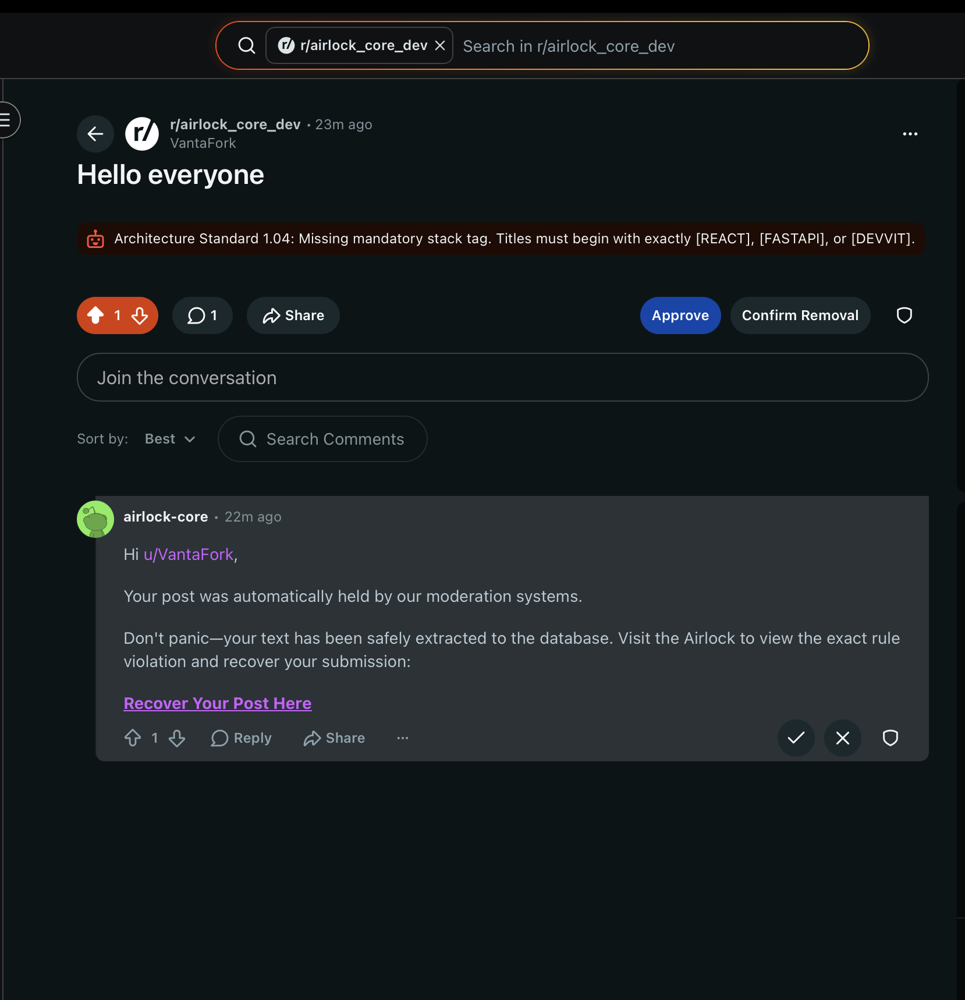
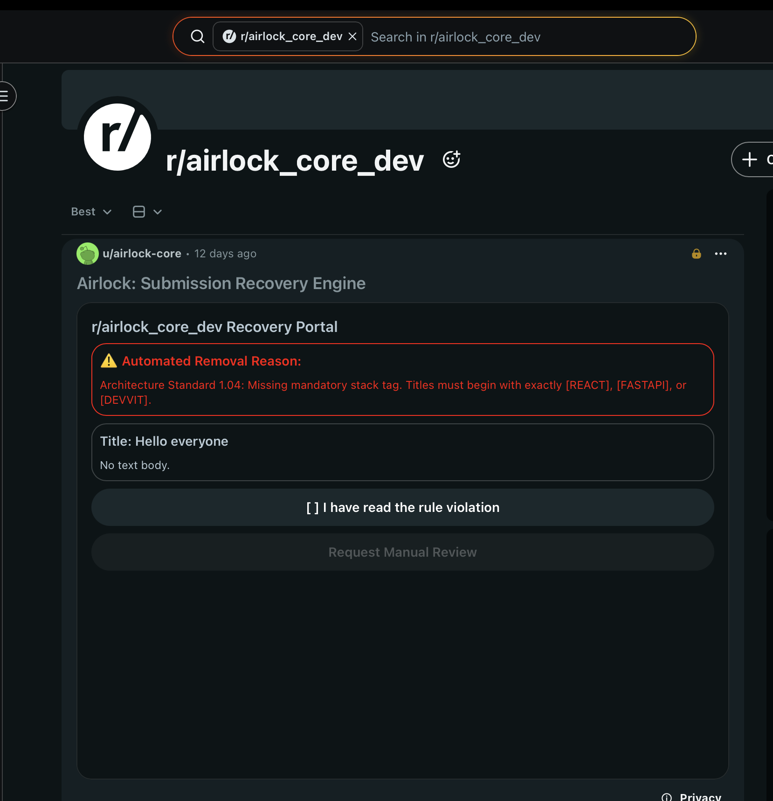
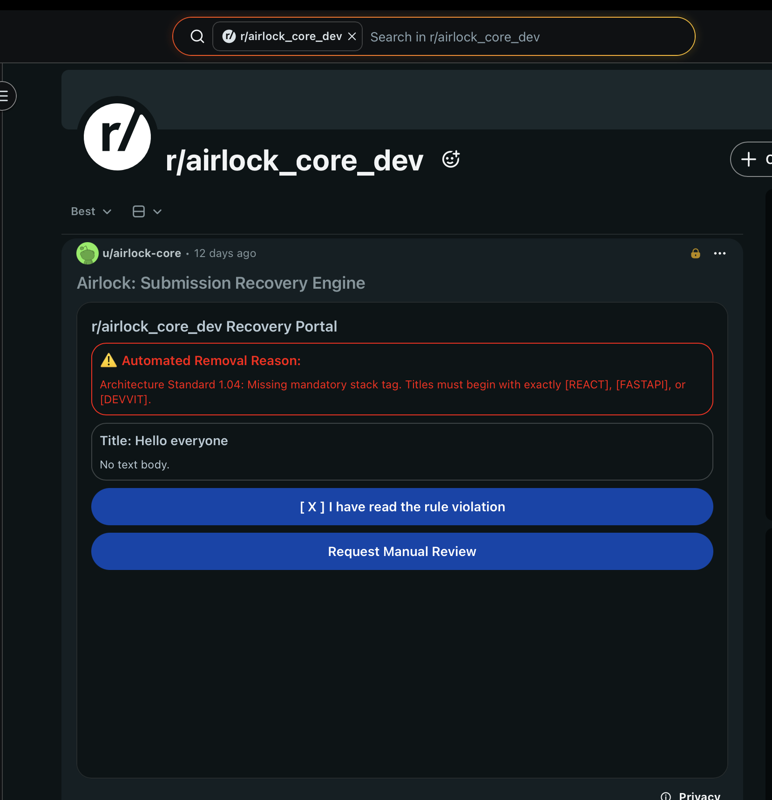
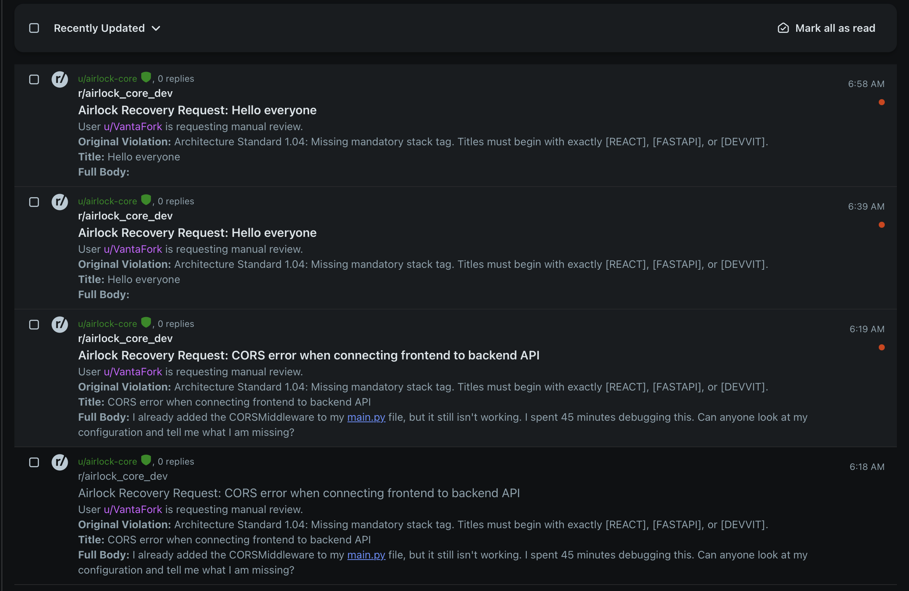

# Airlock — Submission Recovery Engine

> *AutoMod silently removes a new member's post. They never find out why. They never come back. Airlock fixes that.*

---

## The Problem

Every day, Reddit's AutoModerator silently removes thousands of posts from new members — wrong flair, missing formatting, low karma threshold. The user gets no explanation, no path forward, and no reason to stay.

**The result:**
- New members rage-quit or flood ModMail with "why was my post deleted?"
- Mods spend 3–5 minutes per user writing the same explanation, finding the removed post, and manually walking them through resubmission
- Good community members are lost permanently to a silent robot

For a mid-sized subreddit filtering 20 new users per day, that's **~9 hours of mod time wasted per week** on avoidable back-and-forth.

---

## What Airlock Does

Airlock is a background intelligence layer that runs silently inside your subreddit. Every 60 seconds, the **Airlock Sweeper** scans the Moderation Log for AutoModerator strikes.

When it finds one:

1. **Extracts** the user's post title, body, and the exact AutoMod violation reason
2. **Saves** the draft securely to the Devvit KV Store, keyed to the author's username
3. **Posts a comment** on the removed thread pointing the user to the **Airlock Recovery Portal** — a locked Custom Post that acts as a persistent, session-authenticated recovery interface

When the user opens the Recovery Portal:

1. They see **exactly which rule they violated**, extracted from the AutoMod action reason
2. They see a **preview of their saved draft** (title + truncated body)
3. They acknowledge the rule violation with a single checkbox
4. They click **"Transmit Full Draft to Mod Queue"** — which fires a structured ModMail conversation containing their complete, untruncated text directly to the mod team

The mod sees a clean, pre-organized modmail thread. One click. Done.

**Resolution time: 4 minutes → under 30 seconds.**

---

## Screenshots

**Step 1 — AutoMod filters a post with a violation reason**


**Step 2 — Airlock posts a recovery comment automatically**


**Step 3 — User opens the Recovery Portal**


**Step 4 — User acknowledges and submits**


**Step 5 — Mod receives structured recovery request**


## Architecture

Airlock uses a **Human-in-the-Loop (HITL) Middleware** pattern with four components:

### Component A — The Airlock Sweeper (Background Cron Job)
The engine of the application. Runs on a `* * * * *` (60-second) heartbeat via `Devvit.addSchedulerJob`.

```
Wake up → Scan getModerationLog (last 15 actions)
→ Filter for AutoModerator post removals
→ Deduplication check via processed_log:{id} in KV Store
→ Fetch post via getPostById
→ Extract violation reason from ModLog details field
→ Save draft JSON to draft:{authorName} in KV Store
→ Post recovery comment on removed thread
→ Mark log entry as processed
```

**Why a cron job instead of a webhook trigger?**
Reddit's Devvit platform suppresses event webhooks for AutoModerator actions to prevent recursive bot loops. The Sweeper bypasses this limitation entirely by retroactively polling the Moderation Log — no webhooks required.

### Component B — The Singleton Recovery Portal (Custom Post UI)
One locked Custom Post per subreddit. All recovered drafts flow through it.

- **Session Authentication**: Uses `useAsync` + `context.reddit.getCurrentUser()` to identify the viewer
- **Draft Lookup**: Queries `draft:{currentUsername}` from KV Store — users can only ever see their own drafts
- **TTL Enforcement**: Drafts older than 7 days are automatically purged on access
- **UI Compression**: Body text truncated at 120 characters in preview to prevent button overflow on mobile. Full text is preserved in KV Store and transmitted on submit.
- **Empty State**: Users with no pending draft see "Airlock is Empty" — clean, no errors

### Component C — ModMail Handshake (Data Transmission)
When the user submits:
- `context.reddit.modMail.createConversation` fires with the full untruncated body, violation reason, and username
- The draft is deleted from KV Store (`kvStore.delete`) — no duplicate submissions possible

### Component D — Ignition Switches (Mod Menu)
Two mod menu actions handle initialization:
- **"Airlock: Spawn Recovery Post"** — creates the Singleton, locks it, stores its ID
- **"Airlock: Ignite Sweeper Engine"** — starts the 60-second cron heartbeat

---

## KV Store Schema

```
singleton_post_id          → String (e.g. "t3_1tlnkif")
processed_log:{ModLog_ID}  → "true" (deduplication ledger)
draft:{username}           → JSON:
  {
    "title":     "User's original post title",
    "body":      "User's original body text",
    "author":    "username",
    "violation": "AutoMod action_reason",
    "savedAt":   1716493200000,
    "status":    "pending"
  }
```

---

## Installation

**Requirements:** Moderator access to your subreddit.

**Step 1 — Install the app** from the [Devvit App Directory](https://developers.reddit.com/apps/airlock-core).

**Step 2 — Initialize Airlock** via the Mod Menu (three dots → subreddit menu):
1. Click **"Airlock: Spawn Recovery Post"** — creates and locks the Recovery Portal
2. Click **"Airlock: Ignite Sweeper Engine (Run Once)"** — starts the background scanner

That's it. Airlock is now running.

**Optional:** Configure which AutoMod rule names to intercept via the App Settings panel. Default: `New Account Filter`.

---

## Community Impact

### r/relationships (3.8M members)
Strict title formatting requirements (`[24M] and [23F]`, mandatory TL;DR). A single missing bracket silently kills an 800-word emotional post. Airlock recovers the text and tells the user exactly what was missing — before they give up.

### r/personalfinance (18.6M members)
New throwaway accounts created for sensitive financial questions are immediately filtered as potential spam. Airlock separates genuine users in crisis from bots by preserving their draft and giving them a structured path to re-engage — without flooding ModMail.

### r/learnprogramming (4.1M members)
Beginners constantly miss code formatting requirements. Instead of a silent removal and a "why was my post deleted?" thread, Airlock shows them the exact rule they violated and lets them resubmit with full context intact.

---

## Impact Metrics

| Metric | Before Airlock | After Airlock |
|--------|---------------|---------------|
| Mod time per filtered user | 3–5 minutes | ~30 seconds |
| ModMail volume (new member removals) | High | Near zero |
| User recovery rate | ~0% (silent removal) | Structured path to resubmission |
| Mod queue organization | Unstructured | Pre-labeled ModMail threads |

For a subreddit filtering 20 new users/day: **~9 hours of mod time recovered per week.**

---

## Technical Notes

**ID Prefixing:** Reddit API methods require the `t3_` prefix, but ModLogs sometimes omit it. Airlock enforces the prefix dynamically: `targetId.startsWith('t3_') ? targetId : 't3_' + targetId`.

**Rate Limiting:** If Reddit returns `grpc invocation failed with status 2 (RATELIMIT)`, the Sweeper recovers naturally — log entries remain unprocessed in KV Store and are retried on the next 60-second heartbeat.

**CSS Constraints:** Devvit `<vstack>` blocks reject standard CSS margin properties. All spacing uses `gap` and `padding` attributes exclusively.

**Deduplication:** Every processed ModLog entry is marked `processed_log:{id} = "true"` before the Sweeper exits. The check runs before any API calls — zero duplicate DMs or comments are possible.

---

## Stack

- **Platform:** Reddit Devvit (`@devvit/public-api`)
- **Language:** TypeScript / TSX
- **Storage:** Devvit KV Store (Redis-backed)
- **Scheduling:** Devvit Scheduler (cron)
- **UI:** Devvit Blocks (native Custom Post)

---

## License

BSD-3-Clause — see [LICENSE](./LICENSE)